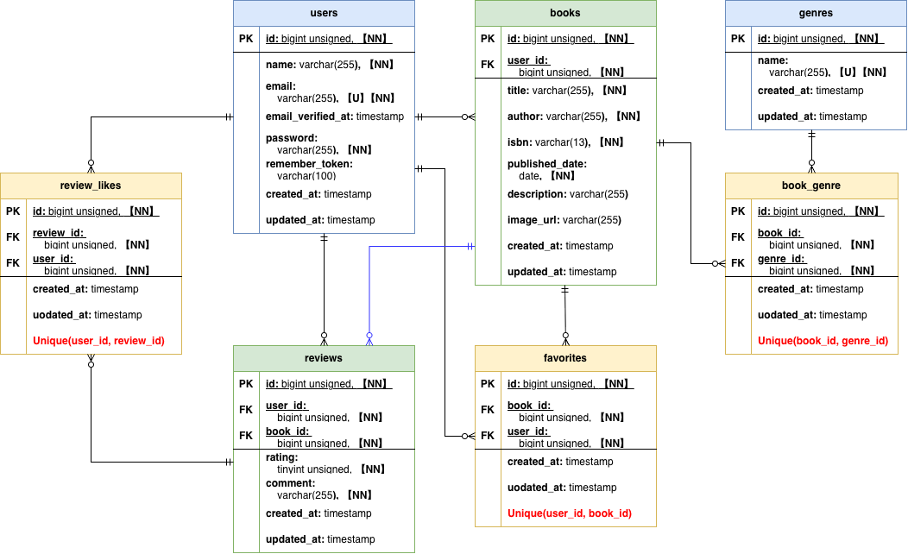

# 書籍レビューアプリ BookShelf

## 概要

本アプリは、COACHTECHの模擬案件で作成した『書籍レビューアプリ』です。

ユーザーは書籍を登録・閲覧し、レビューの投稿やお気に入り登録ができます。
ジャンルによる分類やレビューへのいいね機能、平均評価に基づくランキング機能も備えています。
外部アプリケーション向けの公開API（JSON）も提供します。

- 会員登録/ログイン済みユーザー：書籍一覧・書籍詳細の閲覧、書籍登録・編集(※編集は作成者のみ)、レビューの投稿・編集(※編集は作成者のみ)、ジャンル一覧・詳細の閲覧、ジャンルの登録・編集、お気に入り機能の使用、ランキングの閲覧が可能です。
- 未ログインユーザー：書籍一覧、書籍詳細、ランキングの閲覧が可能です。
- **GitHub URL:** https://github.com/kana686/bookshelf-app.git

## 提出構成について

本リポジトリでは、模擬案件の実装ステップに合わせてブランチを分けて管理しています。

- **基本機能 (`main` ブランチ)**
    - アプリケーションの基本機能を実装・テスト済みです。まずはこのブランチのコードが完成版となります。
- **応用機能 (`feature/advanced` ブランチ)**
    - より発展的な機能の実装に取り組んでいます。
    - **現状**: 一部の応用機能（検索・フィルタ・ISBN検索・読書レポート等）を実装済みです。読書計画や通知機能などは未実装プレースホルダー対応となっています。提出日(卒業日8/17)時点で実装途中ですが、進捗状況の共有として公開しています。
    - 応用編のブランチを確認する場合は、以下のコマンドで切り替えてください。

    ```bash
    git fetch origin
    git checkout feature/advanced
    ```

    - 💡 Google Books APIキーの設定について:
      応用機能の書籍検索等を利用するため、環境構築完了後に .env ファイルへ以下の設定を追加してください。

    ```env
    GOOGLE_BOOKS_API_KEY=あなたのAPIキーを設定してください
    ```

## 目次

- [実装機能一覧](#実装機能一覧)
- [ER図](#er図)
- [環境構築手順](#環境構築手順)
- [プロジェクト設定](#プロジェクト設定)
- [使用技術](#使用技術)

### 実装機能一覧

- 会員登録画面
    - 新規会員登録機能
    - ログイン画面への遷移
- ログイン画面
    - ログイン機能
    - 書籍一覧画面への遷移
    - 会員登録画面へ遷移
- ログアウト
    - セッション破棄・ログアウト機能
- 書籍一覧画面
    - 書籍一覧取得機能
    - 書籍詳細画面へ遷移
    - 書籍登録画面へ遷移
- 書籍詳細画面
    - 書籍詳細取得機能
    - お気に入り機能
    - 書籍削除
    - レビュー投稿機能
    - レビュー一覧取得機能
    - レビューいいね機能
    - 書籍編集画面へ遷移
    - レビュー編集画面へ遷移
    - ジャンル詳細画面へ遷移
- 書籍登録画面
    - 書籍登録機能
- 書籍編集画面
    - 書籍編集機能
- レビュー編集画面
    - レビュー編集機能
- お気に入り一覧画面
    - お気に入り一覧取得機能
- ランキング画面
    - ランキング取得機能
    - 書籍詳細画面へ遷移
- ジャンル一覧画面
    - ジャンル一覧取得機能
    - ジャンル詳細画面へ遷移
    - ジャンル登録画面へ遷移
    - ジャンル編集画面へ遷移
    - ジャンル削除機能
- ジャンル詳細画面
    - ジャンル詳細取得機能
- ジャンル登録画面
    - ジャンル登録機能
- ジャンル編集画面
    - ジャンル編集機能
- 公開API（JSON）
    - 書籍一覧取得API
    - 書籍詳細取得API
    - 書籍新規登録API
    - 書籍更新API
    - 書籍削除API

**応用機能**

- 書籍一覧画面
    - キーワード検索機能（実装済み）
    - ジャンルフィルタ機能（実装済み）
    - 並び順ソート機能（実装済み）
- 書籍登録画面
    - ISBN検索機能（実装済み）
- マイ読書レポート画面
    - 読書統計の表示（実装済み）
- 公開API
    - Sanctum認証(※未実装)
- 読書計画一覧画面（※現在、未実装プレースホルダーを表示）
- 読書計画作成画面（※現在、未実装プレースホルダーを表示）
- 読書計画編集画面（※現在、未実装プレースホルダーを表示）
- 通知一覧画面（※現在、未実装プレースホルダーを表示）
- 日次バッチ処理(※未実装)

## ER図



## 環境構築手順

1.  プロジェクトディレクトリの作成とリポジトリをクローン
    プロジェクト用のディレクトリを作成し、移動してからクローンします。

    ```bash
    mkdir -p [任意のディレクトリ名]
    cd [任意のディレクトリ名]
    git clone https://github.com/kana686/bookshelf-app.git .
    ```

    **💡 補足：応用機能ブランチの確認について**

    > 本リポジトリには「基本編」と「応用編」のブランチがあります。
    > `git fetch origin` を実行しておくことで、基本編の確認後、いつでも応用編のブランチに切り替えて検証できるようになります。
    >
    > ```bash
    > # リモートリポジトリから最新のブランチ情報を取得
    > git fetch origin
    >
    > # 応用編ブランチへ切り替え
    > git checkout feature/advanced
    > ```
    >
    > ※ 応用編の環境構築手順は、応用編のブランチに切り替えた後のREADMEをご確認ください。

2.  環境変数の設定

    ```bash
    # 通常環境用
    cp .env.example .env
    ```

    ※ 必要に応じて .env 内のデータベース設定が以下と一致しているか確認してください。

    ```bash
    DB_CONNECTION=mysql
    DB_HOST=mysql
    DB_PORT=3306
    DB_DATABASE=laravel
    DB_USERNAME=sail
    DB_PASSWORD=password
    ```

    **💡 Google Books APIキーの設定**

    > 応用機能の書籍検索機能等を利用するために、`.env` ファイルの末尾などに以下の環境変数を追記してください。
    >
    > ```env
    > GOOGLE_BOOKS_API_KEY=あなたのAPIキーを設定してください
    > ```
    >
    > _(※APIキーを設定しない場合、関連する外部API機能以外は通常通り動作します)_

3.  依存パッケージのインストール

    Composerを使用してライブラリをインストールします。

    ```bash
    docker run --rm \
        -u "$(id -u):$(id -g)" \
        -v "$(pwd):/var/www/html" \
        -w /var/www/html \
        -e COMPOSER_CACHE_DIR=/tmp/composer_cache \
        laravelsail/php84-composer:latest \
        composer install
    ```

    <details>
    <summary><b>※推奨設定：エイリアスの登録</b></summary>

    `sail`コマンドを短縮して入力できるようにするため、エイリアスの設定を推奨します。
    これにより`./vendor/bin/sail`を毎回入力する手間が省けます。

    Zshの場合（macOS Catalina以降のデフォルト）

    ```bash
    echo "alias sail='[ -f sail ] && bash sail || bash vendor/bin/sail'" >> ~/.zshrc
    ```

    Bashの場合

    ```bash
    echo "alias sail='[ -f sail ] && bash sail || bash vendor/bin/sail'" >> ~/.bashrc
    ```

    設定を反映するために、シェルを再起動します。(ターミナルの再起動)

    ```bash
    exec $SHELL
    ```

    この設定により、以降`sail`コマンドだけでSailを実行できるようになります。

    ```bash
    # エイリアス設定前
    ./vendor/bin/sail up -d

    # エイリアス設定後
    sail up -d
    ```

    </details>

4.  Dockerコンテナの起動

    ```bash
    sail up -d
    ```

5.  アプリケーションキーの生成
    通常環境用と、テスト環境用の両方のキーを生成します。

    ```bash
    # 通常環境用
    sail artisan key:generate
    ```

6.  データベースの構築
    テーブルを作成し、マイグレーションを実行します。

    ```bash
    sail artisan migrate --seed
    ```

    このコマンドの入力後、下記のエラーが表示されることがあります。

    ```bash
     Illuminate\Database\QueryException
    SQLSTATE[HY000] [1044] Access denied for user 'sail'@'%' to database 'contact-form-app' (Connection: mysql, SQL: select table_name as `name`,         (data_length + index_length) as `size`, table_comment as `comment`, engine as `engine`, table_collation as `collation` from information_schema.tables where table_schema = 'contact-form-app' and table_type in ('BASE TABLE', 'SYSTEM VERSIONED') order by table_name)

    at vendor/laravel/framework/src/Illuminate/Database/Connection.php:829
        825▕                     $this->getName(), $query, $this->prepareBindings($bindings), $e
        826▕                 );
        827▕             }
        828▕
    ➜ 829▕             throw new QueryException(
        830▕                 $this->getName(), $query, $this->prepareBindings($bindings), $e
        831▕             );
        832▕         }
        833▕     }

    +43 vendor frames

    44  artisan:35
        Illuminate\Foundation\Console\Kernel::handle()
    ```

    このエラーはコンテナ内にデータが残っており、エラーが生じているケースなどがあります。 その場合は、以下のコマンドを順に実行して各コンテナを再起動して下さい。

    ```bash
    sail down -v
    sail up -d　//コマンド実行後にSQLコンテナが立ち上がるまで時間がかかります。30秒ほどお待ちください。
    sail artisan migrate:fresh --seed
    ```

7.  テスト用アカウント
    環境構築後、すぐに動作確認ができるよう、以下のテスト用アカウントが自動生成されます。ログイン機能の確認にご使用ください。
    メールアドレス: yamada@example.com
    パスワード: password

8.  フロントエンドの準備
    パッケージをインストールし、開発用ビルドを実行します。

    ```bash
    # パッケージのインストール
    sail npm install
    ```

    **開発用ビルド（変更監視モード）**

    開発用サーバーが起動するとターミナルが占有されます。
    ターミナルの「新しいウィンドウ（またはタブ）」を開き、プロジェクトのディレクトリに移動してから下記コマンドを実行してください。

    ```bash
    sail npm run dev
    ```

9.  テストの実行とカバレッジの確認
    **テストの実行**
    開発中の機能が正常に動作しているかを確認するために、以下のコマンドでテストを実行できます。

    ```bash
    sail test
    ```

    **カバレッジの確認**

    ```bash
    sail test --coverage
    ```

## プロジェクト設定

本プロジェクトでは、日本国内での利用を想定し`config/app.php`にて以下の設定を行っています。

- タイムゾーン:`Asia/Tokyo`（日本標準時）
- 言語（ロケール）:`ja`（日本語）
- Fakerロケール:`ja_JP`（テストデータ生成時の日本語対応）

## 使用技術

### バックエンド

- PHP 8.5
- Laravel 12.62
- Laravel Fortify (認証)

### データベース

- MySQL 8.4
- phpMyAdmin

### フロントエンド(提供ファイル使用)

- Tailwind CSS / Vite

### 開発支援ツール

- **Docker / Laravel Sail:** 開発環境構築
- **Laravel Pint:** PHPコードスタイル校正
- **Prettier:** フロントエンドコード整形

### 外部API / その他

- **Google Books API:** 書籍のISBN検索・外部書籍データ連携

**開発環境URL**: http://localhost

**作成者**: 乾 華菜
